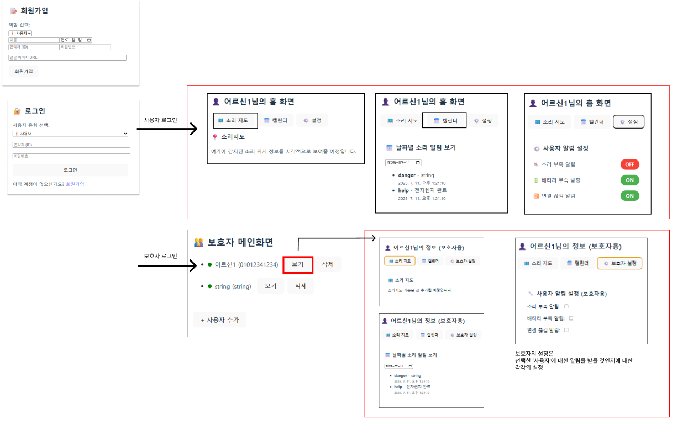

# 실내 소리 감지 기반 사용자 알림 시스템 - BE

FastAPI + MySQL + Docker  기반의 REST API 백엔드 서버  

## 7/12 기준 데이터흐름


---

##  개발 환경
- Python 3.10
- FastAPI
- SQLAlchemy
- MySQL 8 (Docker 사용)
- Pydantic
- Docker & Docker Compose
- 개발 IDE: **PyCharm Community 2024.1**
- 가상환경: **`.venv` (프로젝트 루트 내 생성)**

---

## 로컬 개발용 실행 방법 (PyCharm 기준)

### 1. 프로젝트 클론

```bash
git clone https://github.com/Al-Chaser/BE.git
cd BE
```
### 2. python 가상환경 생성
```
python -m venv .venv            # 가상환경 생성
source .venv/Scripts/activate   
    
pip install --upgrade pip
pip install -r requirements.txt
```
### 3. Docker 기반 실행 방법
- 가장 우선적으로, 도커가 설치되어 있어야 한다.
- .env파일 생성 필요! 현재 gitignore로 .env 숨겨놨기에, 해당 파일 내 필요한 코드는 연락주시면 따로 보내드리겠습니다.
```bash
docker-compose up --build #도커 실행

# 알수없는 오류가 생기거나, 완전히 DB 테이블 확정 이전까지는 데이터 정리 위해 자주 사용할 예정인..
docker-compose down
docker-compose down -v
```
- FastAPI: http://localhost:8000
- MySQL 컨테이너: 내부 포트 db:3306
- 로컬에서 API 문서 테스트 - Swagger UI: http://localhost:8000/docs

## MySQL Workbench 연동 방법
1. MySQL Workbench 실행 후 +버튼 눌러 새 연결 생성
2. Hostname: 127.0.0.1, port: 3310, Username: root, Password: 1234 입력 후 생성

## 추가 정보
- 프론트엔드 연동 시 CORS는 현재 기준, http://localhost:5173 기준으로 허용되어 있습니다.